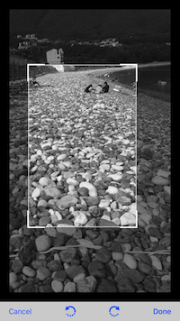

# PKCCrop


[](http://cocoapods.org/pods/PKCCrop)
[](http://cocoapods.org/pods/PKCCrop)
[](http://cocoapods.org/pods/PKCCrop)

## example Image





## Example

To run the example project, clone the repo, and run `pod install` from the Example directory first.

<br><br>

### - ViewController
~~~~

PKCCropHelper.shared.isNavigationBarShow = false
let cropVC = PKCCrop().cropViewController(UIImage(named: "image.jpeg")!)
cropVC.delegate = self
self.present(cropVC, animated: true, completion: nil)

~~~~

<br>

### - PKCCrop Delegate


~~~~

extension ViewController: PKCCropDelegate{
//return Crop Image & Original Image
func pkcCropImage(_ image: UIImage?, originalImage: UIImage?) {

}

//If crop is canceled
func pkcCropCancel(_ viewController: PKCCropViewController) {
viewController.navigationController?.popViewController(animated: true)
}

//Successful crop
func pkcCropComplete(_ viewController: PKCCropViewController) {
if viewController.tag == 0{
viewController.navigationController?.popViewController(animated: true)
}else{
viewController.dismiss(animated: true, completion: nil)
}
}
}

~~~~


<br><br>


## Installation

PKCCrop is available through [CocoaPods](http://cocoapods.org). To install
it, simply add the following line to your Podfile:

```ruby
pod "PKCCrop"
```

## Author

pikachu987, pikachu987@naver.com

## License

PKCCrop is available under the MIT license. See the LICENSE file for more info.
